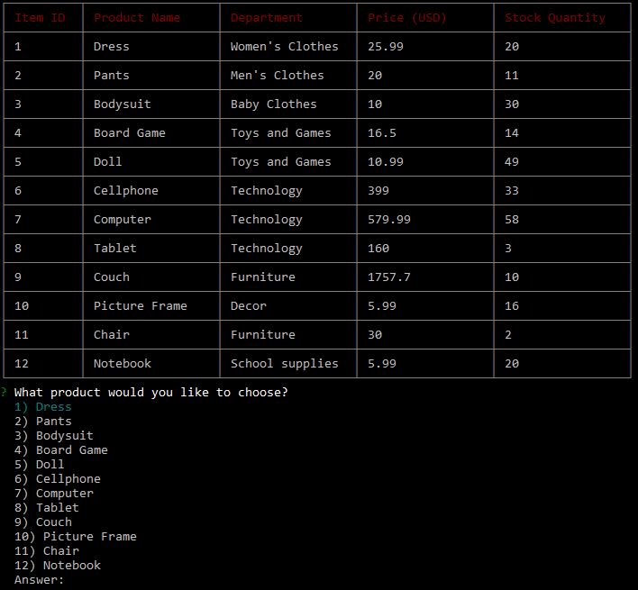
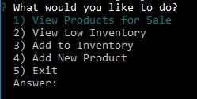
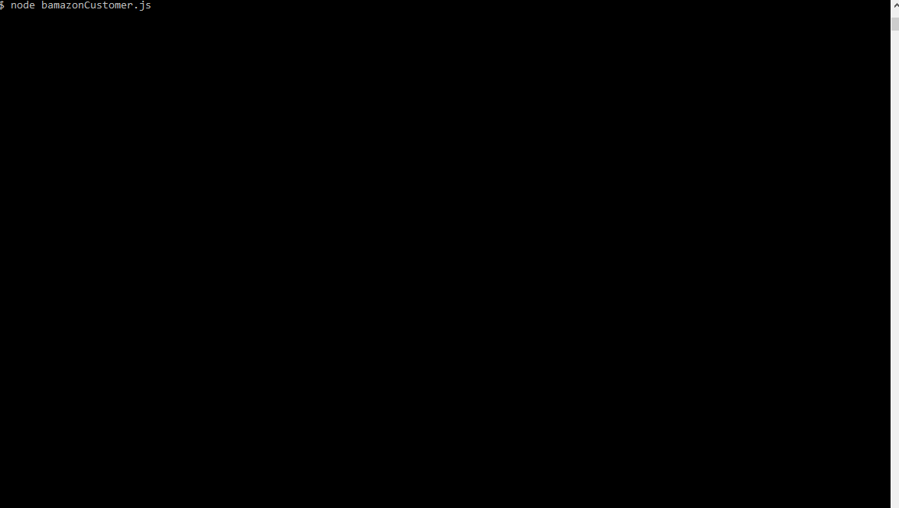
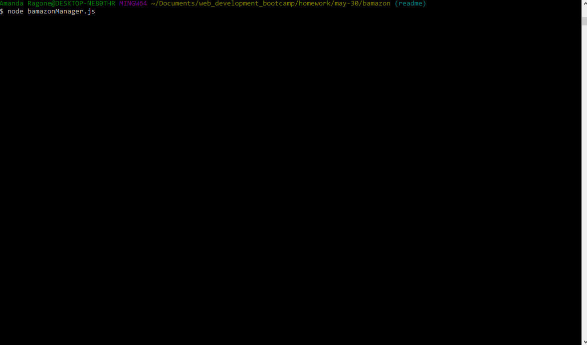

<h1>Bamazon Node App</h1>

Use the Bamazon app to manage your store inventory and allow your customers to easily choose which products to purchase.

Release 1.0 MVP CLI app - Customer view:

Release 2.0 MVP CLI app - Manager view:

This is a CLI app, so it's not deployed to GitHub pages. To use it, please download the code published here in this repository.

After downloading the files contained in this repository, you'll also need to run `npm install` in your Terminal.

<h2>MVP</h2>

<h3>Release 1.0 - Customer view</h3>
Phase One: Create the bamazon DB and populate it.

Phase Two: Create the DB connection, confirm that the code can read what's in the DB and format response in a table.

Phase Three: Create prompt that allows the user to select a product and the quantity desired.

Phase Four: Create logic that reads how many items are in stock and then decides if there are enough items to be purchased or not.

<h3>Release 2.0 - Manager view</h3>
Phase One: Create prompt that allows a manager to select which task needs to be performed.

Phase Two: Allow the manager to view all products available for sale. Make sure the list is formatted the same way it is in the Customer view.

Phase Three: Allow the manager to view low inventory products (that is, products with less than 5 items in stock). Make sure that the list is formatted properly as well.

Phase Four: Allow the manager to replenish the stock quantity for an existing item. Ensure that the DB is updated properly.

Phase Five: Allow the manager to create a brand new product in the DB and ensure that the DB is updated accordingly as well.

<h2>Project Management</h2>
[Project Board - Customer View](https://github.com/amandalragone/bamazon/projects/1)
[Project Board - Manager View](https://github.com/amandalragone/bamazon/projects/2)

<h2>How to use this app</h2>

<h3>Customer view</h3>
1. Open Terminal.

2. Navigate to the folder where the code is stored. (For example: `cd <Documents>/<my-repository>` )

3. Use the command `node bamazonCustomer.js` to run the Customer View.

4. Select which product you'd like to purchase.

5. Define how many items you'd like.

* If the purchase is successful, you'll see a message with your total on the screen and the connection will end. If there's not enough items in stock, you'll see an error and be asked to start the purchase again:

<h3>Manager view</h3>
1. Open Terminal.

2. Navigate to the folder where the code is stored. (For example: `cd <Documents>/<my-repository>` )

3. Use the command `node bamazonCustomer.js` to run the Customer View.

4. Select which task you need to perform:

* If you select View Products for Sale, a table containing all products in stock will be displayed:

* If you select View Low Inventory, a table containing all products with less than five items in stock will be displayed:

* If you select Add to Inventory, you'll be prompted to select which product needs to be replenished and how many items should be added:

* If you select Add New Product, you'll be allowed to enter a brand new product. Make sure to specify its name and price, as well as which department it belongs to and how many items are in stock:

* If you've changed your mind and don't need to perform any actions at the moment, you can hit Exit to end the connection.

<h2>Future Direction</h2>
- Create a supervisor view to check out which departments sell more products and bring more revenue.